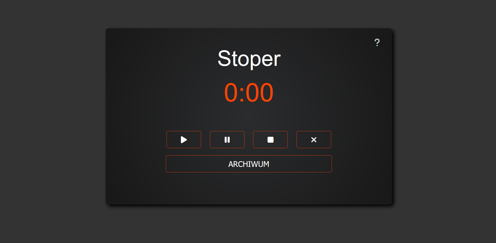

# Stopwatch

    </img>

## Description

- Very small "one day made" app.
- The stopwatch measures time in seconds and has an archive with previous time results.
- I created it to master vanilla JavaScript and building mini-logic apps.

#### Technology used:
- HTML, CSS, JS
- SCSS

## What I Learned

- Using vanilla JavaScript in building mini-logic apps.
- Creating small modal with instruction how to use app.

## Author info

- **Name:** Filip Bereszyński
- **Age:** 21 years old
- **Contact:**
    - bereszynski.filip@gmail.com
    - (+48) 510 240 074